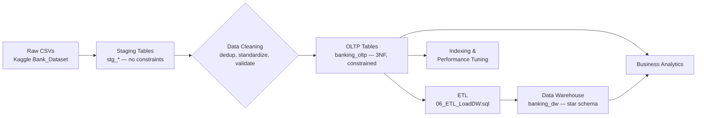

# Project Architecture

## Pipeline Flow

## Why a staging layer?
The source CSVs had duplicate business keys with conflicting values per row (see Data Dictionary). Loading straight into constrained OLTP tables would fail on the first duplicate primary key. Staging tables have no constraints, so raw data always loads; the cleaning script then applies a deterministic dedup rule before writing into the constrained final tables — the same pattern used in real-world ETL pipelines.

## Why two fact tables?
- `fact_transaction` — transactional grain, one row per transaction, supports time-series and behavioral analysis.
- `fact_loan` — accumulating-snapshot grain, one row per loan, supports portfolio and risk analysis (e.g. loan-to-deposit ratio).

Splitting them avoids forcing unrelated measures (transaction_amount vs loan_amount) into a single fact table with mismatched grains.

## Tech stack
- **Database**: MySQL 8 (window functions, recursive CTEs)
- **ETL**: pure SQL (staging + transform-load, loaded via Table Data Import Wizard)
- **Design**: 3NF OLTP schema, star-schema data warehouse
- **Tooling**: MySQL Workbench for execution and EXPLAIN ANALYZE

## Script execution order
See the "How to Run" table in the main `README.md` for the full run order and what each script does.
