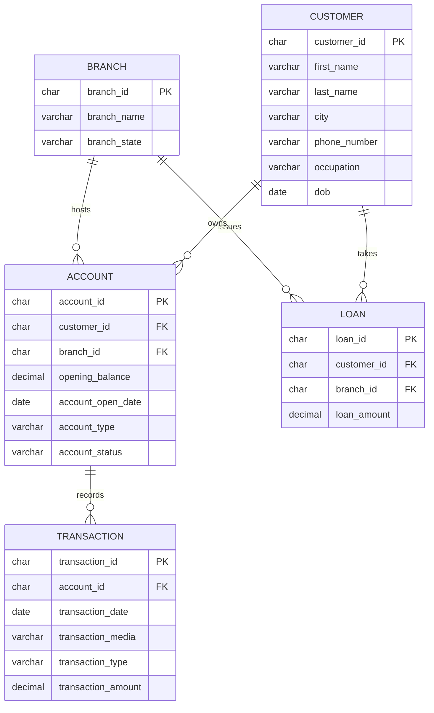
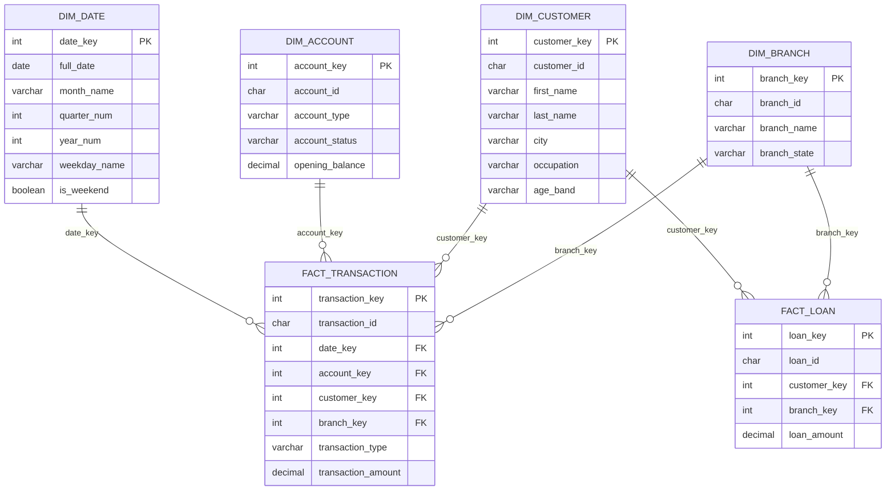

# ER Diagrams

## OLTP Schema (`banking_oltp`)

```mermaid
erDiagram
    BRANCH ||--o{ ACCOUNT : hosts
    BRANCH ||--o{ LOAN : issues
    CUSTOMER ||--o{ ACCOUNT : owns
    CUSTOMER ||--o{ LOAN : takes
    ACCOUNT ||--o{ TRANSACTION : records

    BRANCH {
        char branch_id PK
        varchar branch_name
        varchar branch_state
    }
    CUSTOMER {
        char customer_id PK
        varchar first_name
        varchar last_name
        varchar city
        varchar phone_number
        varchar occupation
        date dob
    }
    ACCOUNT {
        char account_id PK
        char customer_id FK
        char branch_id FK
        decimal opening_balance
        date account_open_date
        varchar account_type
        varchar account_status
    }
    LOAN {
        char loan_id PK
        char customer_id FK
        char branch_id FK
        decimal loan_amount
    }
    TRANSACTION {
        char transaction_id PK
        char account_id FK
        date transaction_date
        varchar transaction_media
        varchar transaction_type
        decimal transaction_amount
    }
```

## Data Warehouse Star Schema (`banking_dw`)

```mermaid
erDiagram
    DIM_DATE ||--o{ FACT_TRANSACTION : "date_key"
    DIM_ACCOUNT ||--o{ FACT_TRANSACTION : "account_key"
    DIM_CUSTOMER ||--o{ FACT_TRANSACTION : "customer_key"
    DIM_BRANCH ||--o{ FACT_TRANSACTION : "branch_key"
    DIM_CUSTOMER ||--o{ FACT_LOAN : "customer_key"
    DIM_BRANCH ||--o{ FACT_LOAN : "branch_key"

    DIM_DATE {
        int date_key PK
        date full_date
        varchar month_name
        int quarter_num
        int year_num
        varchar weekday_name
        boolean is_weekend
    }
    DIM_CUSTOMER {
        int customer_key PK
        char customer_id
        varchar first_name
        varchar last_name
        varchar city
        varchar occupation
        varchar age_band
    }
    DIM_BRANCH {
        int branch_key PK
        char branch_id
        varchar branch_name
        varchar branch_state
    }
    DIM_ACCOUNT {
        int account_key PK
        char account_id
        varchar account_type
        varchar account_status
        decimal opening_balance
    }
    FACT_TRANSACTION {
        int transaction_key PK
        char transaction_id
        int date_key FK
        int account_key FK
        int customer_key FK
        int branch_key FK
        varchar transaction_type
        decimal transaction_amount
    }
    FACT_LOAN {
        int loan_key PK
        char loan_id
        int customer_key FK
        int branch_key FK
        decimal loan_amount
    }
```
